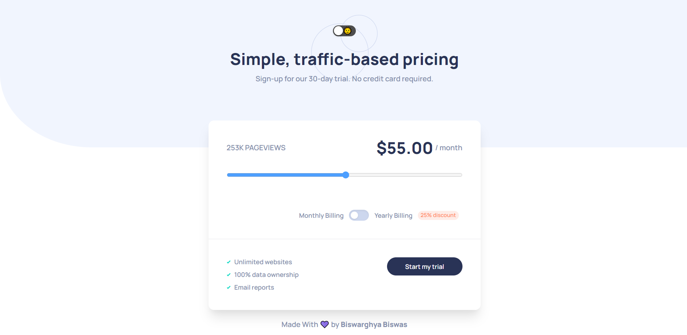
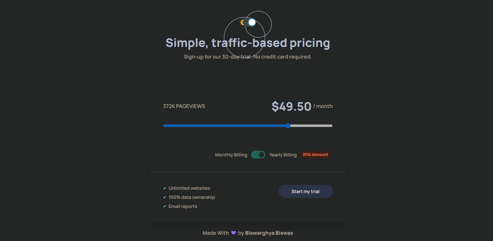

# Frontend Mentor - Interactive pricing component solution

This is a solution to the [Interactive pricing component challenge on Frontend Mentor](https://www.frontendmentor.io/challenges/interactive-pricing-component-t0m8PIyY8). Frontend Mentor challenges help you improve your coding skills by building realistic projects. 

## Table of contents

- [Overview](#overview)
  - [The challenge](#the-challenge)
  - [Screenshot](#screenshot)
  - [Links](#links)
- [My process](#my-process)
  - [Built with](#built-with)
  - [Useful resources](#useful-resources)
- [Author](#author)

## Overview

### The challenge

Users should be able to:

- View the optimal layout for the app depending on their device's screen size
- See hover states for all interactive elements on the page
- Use the slider and toggle to see prices for different page view numbers

### Screenshots

### Links

- Solution URL: [https://www.frontendmentor.io/solutions/interactive-pricing-component-solution-using-react-react-dark-reader-8IeairoR95](https://your-solution-url.com)
- Live Site URL: [https://interactive-pricing-component-using-react.vercel.app/](https://your-live-site-url.com)

## My process

### Built with

- Semantic HTML5 markup
- [React](https://reactjs.org/) - JS library
- [Tailwind CSS](https://tailwindcss.com/) - For styles

### Useful resources

- [React DarkReader](https://www.npmjs.com/package/react-darkreader) - This helped me for adding the pitch black dark mode to the site in an easy way.

## Author

- Frontend Mentor - [@lazyfuhrer](https://www.frontendmentor.io/profile/lazyfuhrer)
